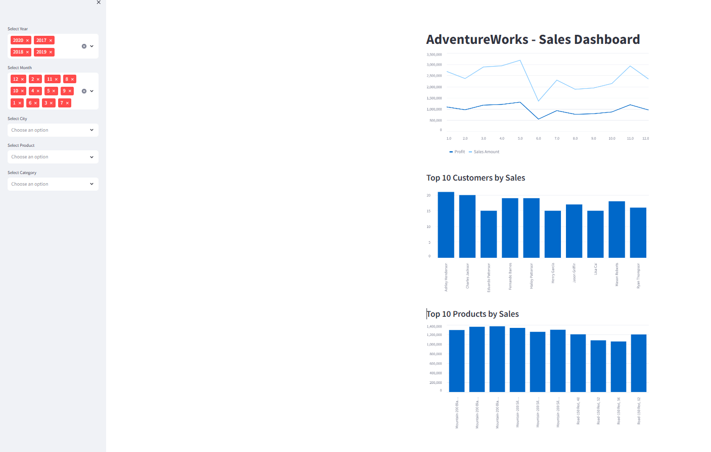
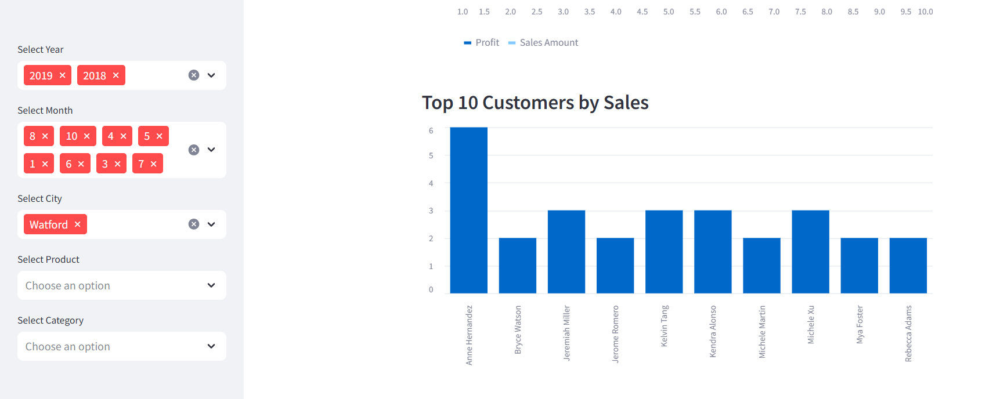
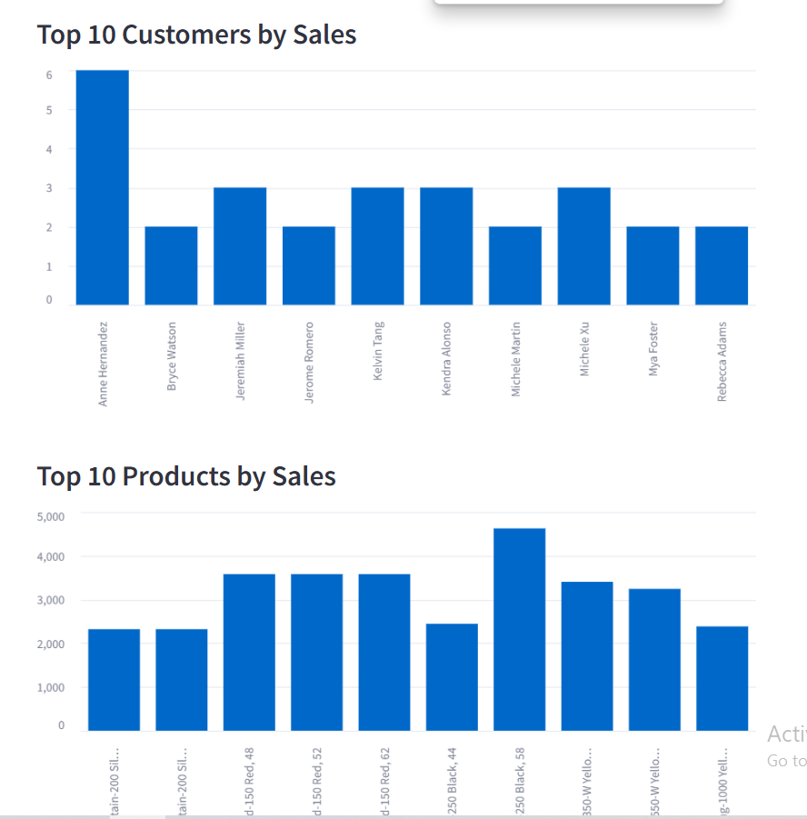
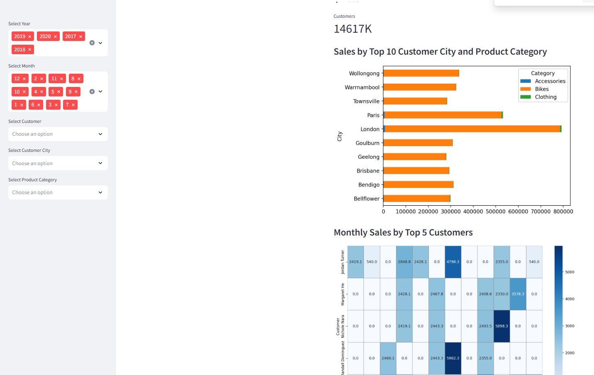

### AdventureWorks-Sales-Streamlit

This project involves creating a data visualization app using Streamlit to explore and analyze sales data from a well-known bicycle brand, AdventureWorks. (이 프로젝트는 AdventureWorks라는 유명한 자전거 브랜드의 판매 데이터를 탐색하고 분석하기 위해 Streamlit을 사용하여 데이터 시각화 앱을 만드는 것입니다.) The app allows users to filter data and visualize key metrics and charts interactively. (이 앱은 사용자가 데이터를 필터링하고 주요 지표와 차트를 인터랙티브하게 시각화할 수 있도록 해줍니다.) The project's main challenges included cleaning and preparing the data, merging different sheets from the provided Excel file, and implementing the visualizations in Streamlit. (프로젝트의 주요 과제는 데이터를 정리하고 준비하는 것, 제공된 Excel 파일의 여러 시트를 병합하는 것, 그리고 Streamlit에서 시각화를 구현하는 것이었습니다.)

---

### Data Preparation

The data was sourced from an Excel file containing multiple sheets. (데이터는 여러 시트가 포함된 Excel 파일에서 가져왔습니다.) The data preparation process included: (데이터 준비 과정에는 다음이 포함되었습니다:)

1. **Feature Engineering:** Creating new features to enhance the data analysis. (데이터 분석을 개선하기 위한 새로운 특성 생성)
2. **Data Wrangling:** Cleaning and organizing the data to ensure consistency and accuracy. (데이터의 일관성과 정확성을 보장하기 위해 데이터 정리 및 조직화)
3. **Merging Sheets:** Combining data from different sheets using appropriate keys. (적절한 키를 사용하여 서로 다른 시트에서 데이터를 결합)
4. **Data Serialization:** Saving the processed data into two separate pickle files for efficient loading in Streamlit. (Streamlit에서 효율적인 로딩을 위해 처리된 데이터를 두 개의 별도 피클 파일로 저장)

---

### Streamlit Application

The Streamlit application allows users to explore the sales data interactively. (Streamlit 애플리케이션은 사용자가 판매 데이터를 인터랙티브하게 탐색할 수 있도록 합니다.) Key features include: (주요 기능은 다음과 같습니다:)

1. **Filtering Options:** Users can filter the data by various criteria such as product category, date range, and geographic region. (사용자는 제품 카테고리, 날짜 범위, 지리적 지역 등 다양한 기준으로 데이터를 필터링할 수 있습니다.)
2. **Data Visualization:** The app includes various charts, such as bar graphs, line charts, and pie charts, to visualize sales trends, product performance, and other key metrics. (앱에는 판매 동향, 제품 성과 및 기타 주요 메트릭을 시각화하기 위한 막대 그래프, 라인 차트 및 원형 차트와 같은 다양한 차트가 포함되어 있습니다.)
3. **Key Metrics Display:** Important metrics like total sales, average order value, and best-selling products are highlighted. (총 판매량, 평균 주문 금액, 베스트셀러 제품과 같은 중요한 지표가 강조 표시됩니다.)

---

### Python files

The code for the project is available on GitHub, along with screenshots demonstrating the application in action. (프로젝트의 코드는 GitHub에서 사용할 수 있으며, 애플리케이션 실행 모습을 보여주는 스크린샷도 포함되어 있습니다.)

1. **Sales Dashboard:** Overview of the key metrics and filters. (주요 메트릭 및 필터 개요)
 
 
 
3. **Customers:** Line chart showing sales trends over time. (시간 경과에 따른 판매 동향을 보여주는 라인 차트)
 

5.  
6. **Depth Analysis:** 
7.  

---

Feel free to check out the [GitHub repository](#) for the complete code and further details. (전체 코드와 자세한 내용은 [GitHub 저장소](#)에서 확인할 수 있습니다.) This project demonstrates a comprehensive approach to data analysis and visualization using Python and Streamlit. (이 프로젝트는 Python과 Streamlit을 사용한 데이터 분석 및 시각화에 대한 포괄적인 접근 방식을 보여줍니다.)

